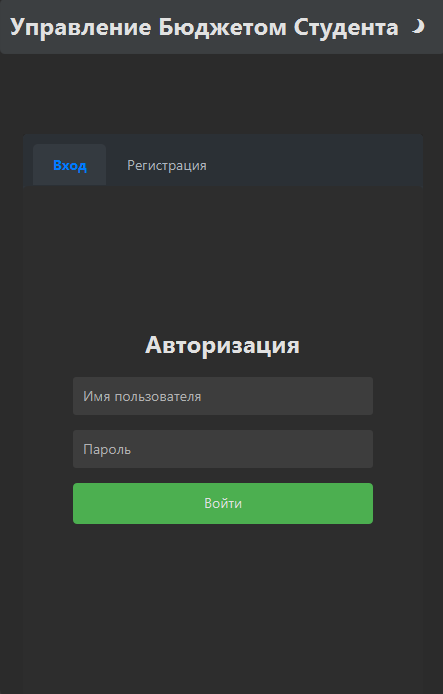
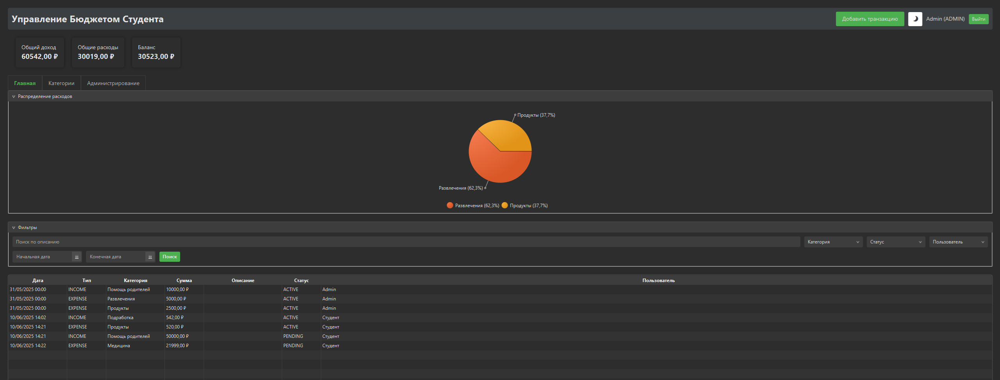
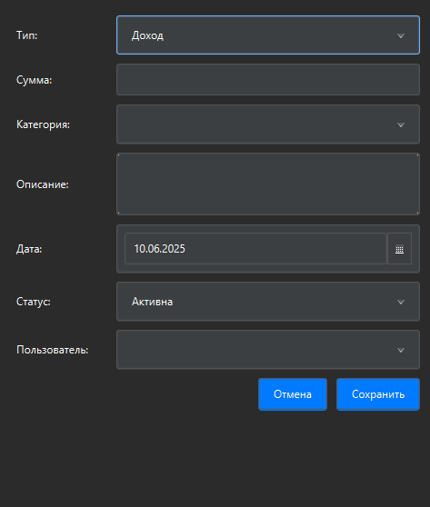
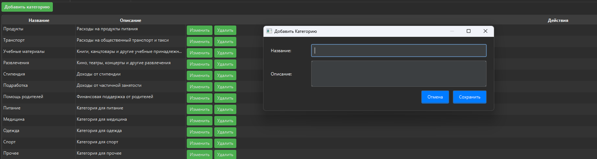
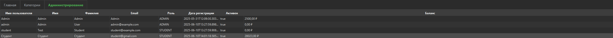

# Руководство пользователя Student Budget Manager

## Содержание
1. [Интерфейс приложения](#интерфейс-приложения)
   - [Окно входа](#окно-входа)
   - [Окно регистрации](#окно-регистрации)
   - [Главное окно](#главное-окно)
   - [Диалог транзакции](#диалог-транзакции)
   - [Окно категорий](#окно-категорий)
   - [Панель администратора](#панель-администратора)
2. [Пошаговые инструкции](#пошаговые-инструкции)
   - [Вход в систему](#вход-в-систему)
   - [Управление транзакциями](#управление-транзакциями)
   - [Работа с категориями](#работа-с-категориями)
   - [Административные функции](#административные-функции)

## Интерфейс приложения

### Окно входа

Окно входа содержит:
- Поле для ввода имени пользователя
- Поле для ввода пароля
- Кнопку "Войти"
- Кнопку "Регистрация" для создания нового аккаунта
- Опцию "Забыли пароль?"

### Окно регистрации

При регистрации нового пользователя необходимо заполнить:
- Имя пользователя (логин)
- Пароль (минимум 8 символов)
- Email (для восстановления пароля)
- Имя и фамилию
- Согласие с условиями использования

### Главное окно

#### Основная область
1. **Панель быстрого доступа**
   - Кнопка "Новая транзакция"
   - Текущий баланс
   - Быстрые фильтры

2. **Графики и диаграммы**

   - Круговая диаграмма расходов
   - График доходов/расходов
   - Статистика по категориям

3. **Список транзакций**
   - Колонки:
     - Дата
     - Тип
     - Сумма
     - Категория
     - Описание
     - Статус
   - Возможности:
     - Сортировка по любой колонке
     - Фильтрация
     - Контекстное меню для операций

### Диалог транзакции

#### Создание новой транзакции
1. **Основные поля**
   - Тип транзакции (выпадающий список):
     - Доход
     - Расход
   - Сумма (числовое поле)
   - Категория (выпадающий список)
   - Дата (календарь)
   - Описание (текстовое поле)

2. **Дополнительные опции**
   - Статус транзакции
   - Прикрепление файлов (чеки, квитанции)
   - Повторяющаяся транзакция

#### Редактирование транзакции
- Все поля доступны для редактирования
- Кнопки:
  - "Сохранить"
  - "Отменить"
  - "Удалить" (с подтверждением)

### Окно категорий

#### Список категорий
- Название
- Описание
- Тип (доход/расход)
- Количество транзакций
- Общая сумма

#### Управление категориями
- Создание новой категории
- Редактирование существующей
- Объединение категорий
- Архивация

### Панель администратора

#### Управление пользователями
- Список всех пользователей
- Информация о пользователе:
  - Основные данные
  - Статистика активности
  - История транзакций
- Действия:
  - Блокировка/разблокировка
  - Сброс пароля
  - Изменение роли

#### Управление транзакциями
- Просмотр всех транзакций
- Фильтры:
  - По пользователям
  - По статусу
  - По сумме
- Массовые операции:
  - Утверждение
  - Отклонение
  - Изменение категории

#### Системные настройки
- Настройка лимитов:
  - Максимальная сумма без подтверждения
  - Лимиты по категориям
- Управление категориями:
  - Создание системных категорий
  - Настройка правил
- Настройка уведомлений

## Пошаговые инструкции

### Вход в систему
1. Запустите приложение
2. Введите имя пользователя и пароль
3. Нажмите "Войти"
4. При первом входе рекомендуется:
   - Изменить пароль
   - Настроить профиль
   - Ознакомиться с интерфейсом

### Управление транзакциями

#### Создание транзакции
1. Нажмите кнопку "Новая транзакция"
2. Выберите тип (доход/расход)
3. Введите сумму
4. Выберите категорию
5. Укажите дату
6. При необходимости добавьте описание
7. Нажмите "Сохранить"

#### Редактирование транзакции
1. Найдите транзакцию в списке
2. Двойной клик или кнопка "Редактировать"
3. Внесите изменения
4. Нажмите "Сохранить"

#### Удаление транзакции
1. Выберите транзакцию
2. Нажмите "Удалить"
3. Подтвердите действие

### Работа с категориями

#### Создание категории
1. Откройте раздел "Категории"
2. Нажмите "Новая категория"
3. Заполните:
   - Название
   - Описание
   - Тип (доход/расход)
4. Нажмите "Создать"

#### Управление категориями
1. Выберите категорию
2. Доступные действия:
   - Редактирование
   - Архивация
   - Объединение
3. Подтвердите изменения

### Административные функции

#### Управление пользователями
1. Откройте панель администратора
2. Выберите раздел "Пользователи"
3. Доступные действия:
   - Просмотр информации
   - Блокировка/разблокировка
   - Сброс пароля
   - Изменение роли

#### Утверждение транзакций
1. Откройте раздел "Ожидающие транзакции"
2. Просмотрите детали транзакции
3. Примите решение:
   - Утвердить
   - Отклонить (с указанием причины)
   - Запросить дополнительную информацию

#### Системные настройки
1. Откройте раздел "Настройки"
2. Доступные параметры:
   - Лимиты транзакций
   - Системные категории
   - Правила утверждения
   - Настройки уведомлений
3. Сохраните изменения

## Советы и рекомендации

### Эффективное использование
- Регулярно вносите транзакции
- Используйте подходящие категории
- Проверяйте статистику
- Настройте уведомления

### Безопасность
- Регулярно меняйте пароль
- Проверяйте историю входов
- Сохраняйте резервные копии

### Решение проблем
1. Проверьте подключение к интернету
2. Убедитесь в правильности введенных данных
3. Проверьте системные требования
4. Обратитесь в техподдержку 